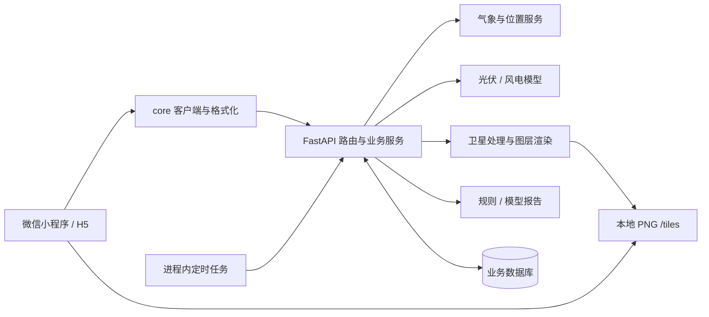

# EnerSight 项目理解与接手指南

> 整理日期：2026-09-08；阅读基线：`45f4585`。
> 本文是基于现有源码、配置和本地检查形成的项目理解，供后续开发与接手使用。
> 既有需求与设计见 [文档索引](./README.md)。本文区分设计目标、实际实现和待验证事项，不替代需求规范，也不代表生产验收结论。

## 一、对项目的整体判断

EnerSight 面向光伏、风电场站，将公开电站目录、气象预报、卫星云图和发电模型组合起来，帮助用户判断今日发电条件、未来天气变化与云层影响，并提供站点报告。

核心业务链路是：**从目录选站 → 获取站点气象 → 计算发电条件 → 查看趋势、地图与预警 → 阅读分析报告**。AI 负责解释已计算的结果，主要数值由服务端物理模型产生。

当前已具备可联调的主要业务链路、数据库迁移、自动化测试和部署脚手架。不过，“功能已有代码”与“可以正式上线”仍有距离：正式微信登录尚未实现，部分设置为占位，生产数据库兼容性与地图真机效果仍需验证。因此，我将项目理解为**主要分析功能已落地、仍需补齐生产闭环的 V1**。

需要首先记住三个边界：

- **运行指标是估算值。** 当前未看到电表、逆变器或 SCADA 实测接入；即时功率、今日发电量均来自气象模型，累计发电量来自已保存的逐日估算记录。
- **公开目录与用户站点是两种数据。** 目录全体用户共享；添加后复制为用户自己的站点，带 `catalog_id` 溯源。目录更新不等于用户站点参数自动更新。
- **页面上的分析文字不都来自大模型。** 默认报告使用规则模板，首页结论、地图展望与预警说明也有直接的规则实现。

## 二、代码结构与职责

| 位置 | 实际职责 | 接手时重点关注 |
| --- | --- | --- |
| `packages/miniapp/` | Taro 4.0.9、React 18、TypeScript 小程序；也支持 H5 构建 | 页面交互、微信地图、请求适配、状态与样式 |
| `packages/core/src/` | 纯 TypeScript 公共层 | 生成类型、HTTP 客户端、单位与时间格式化；不包含指标计算 |
| `packages/server/app/routers/` | FastAPI 路由 | 鉴权、入参、调用服务、封装响应 |
| `packages/server/app/services/` | 业务编排 | 聚合气象、模型、站点、预警、报告及数据库 |
| `packages/server/app/providers/` | Open-Meteo、腾讯位置服务适配 | 外部请求、字段与单位约定 |
| `packages/server/app/metrics/` | 光伏与风电模型、环境指数 | pvlib、太阳位置、辐照转换、风速外推 |
| `packages/server/app/satellite/` | 卫星瓦片、重投影、光流、归档与回放 | 波段选择、缺帧处理、外推有效性 |
| `packages/server/app/render/` | 气象网格与 PNG 渲染 | 块对齐、插值、色阶、磁盘图片 |
| `packages/server/app/ai/` | 报告输入、Provider、结构化输出及降级 | 模型只解释、数值一致性检查 |
| `packages/server/app/models/`、`alembic/` | SQLAlchemy 模型与迁移 | 本地 SQLite、目标生产 PostgreSQL |
| `packages/server/app/jobs/` | APScheduler 进程内任务 | 发电记录、扫描、报告、卫星归档、目录同步 |
| `deploy/`、`.github/workflows/` | Compose、部署脚本、CI | 单实例、外部数据库、镜像构建与检查 |
| `docs/`、`packages/ui/` | 需求规范、校准报告、页面设计图 | 修改前阅读对应专题文档 |

前端由 pnpm workspace 管理，Python 后端由 uv 单独管理，根目录 Makefile 串联两套工具。`pnpm-workspace.yaml` 只包含 `core` 和 `miniapp`，仅运行根目录 `pnpm test` 不会执行后端测试。



接口类型单向生成：`server/app/schemas` 中的 Pydantic 模型 → OpenAPI → `core/src/types/generated.ts`。后端不依赖 core；小程序通过适配器向 core 注入 `Taro.request`、Storage 和重新登录函数。

## 三、用户功能如何落到代码

当前 [页面配置](../packages/miniapp/src/app.config.ts) 注册 9 个页面，其中 5 个为底部导航。

| 页面 | 主要内容 | 代码入口或实现边界 |
| --- | --- | --- |
| 首页 | 当前站点、环境指数、天气、趋势、预警 | `pages/home/index.tsx`；无站点时服务端返回明确空状态 |
| 地图 | 气象贴图、目录电站标记、地点搜索、站点信息 | `pages/map/index.tsx`；风场当前为静态色阶 |
| 预警 | 当前预警、历史记录、卫星云图与云团分析 | `pages/alert/index.tsx`；未看到微信订阅消息发送实现 |
| 站点 | 我的站点、类型筛选、删除与详情入口 | `pages/station/index.tsx` |
| 我的 | 站点数量与设置入口展示 | `pages/mine/index.tsx`；登录、隐私指引、通知设置等仍有占位 |
| 站点详情 | 单站运行估算、趋势与报告入口 | `pages/station/detail.tsx` |
| 站点参数 | 容量、光伏倾角/方位角或风机轮毂高度 | `pages/station/form.tsx`；不提供小程序自建站入口 |
| 公开电站 | 查询目录并添加到我的站点 | `pages/station/catalog.tsx` |
| 分析报告 | 综合判断、三时段分析、风险、建议、数据摘要 | `pages/report/index.tsx` |

### 3.1 添加站点

目录查询 → 提交 `catalog_id` → 服务端复制目录基本信息 → 关联当前用户 → 前端设置当前站点。

小程序当前只提供从目录添加的入口；后端 `CreateStationRequest` 仍保留手工传名称、类型、容量和坐标的创建方式。这是 API 与小程序入口范围的区别，不能写成“服务端禁止自建”。

站点访问经过 `owner_id` 检查。同一用户重复添加相同目录电站时，服务层先查询并返回已有站点；这属于应用层去重，不应直接视为已验证的并发唯一性保证。

### 3.2 首页与站点详情

`services/home.py` 的 `build_station_view()` 是核心聚合点：

1. 获取站点的逐小时气象预报。
2. 在线程池中调用 `energy.compute()`，得到环境指数、今日预测电量与当前小时估算功率。
3. 从逐日发电表读取累计值，组装站点响应。
4. 首页额外执行一次预报规则扫描，再返回当前预警；后台任务负责持续刷新。

站点列表为减少计算量，直接读取逐日发电表中的最新记录；详情则重新计算当前气象对应的指标。因此，列表与详情的刷新时点可能不同。

### 3.3 地图与卫星

地图采用“服务端渲染图片，客户端通过 `ground-overlay` 贴图”的方式。客户端使用服务端返回的 `bounds`，而不是原始请求视窗；图例也由服务端下发。

当前气象块为 **4° × 4°**，取样步长 **1°**（原 0.5° 触发 Open-Meteo 限流后调粗），即每块 **5 × 5** 点，生成 **512 × 512** PNG；每次最多处理 6 块。风、温度、辐射使用气象场，云图优先使用 JMA Himawari 影像，获取失败时地图云图层会回退为预报云量。

卫星分析按太阳高度角选择日间可见光或夜间红外；两帧通过 Farneback 光流估计云团运动，外推上限为 120 分钟，帧间隔过大时不做外推。云团分析与地图云图层有不同的降级路径：卫星分析不可用时返回不可用状态，不能把它解释为无云。

关键入口：[图层服务](../packages/server/app/services/layers.py)、[气象网格](../packages/server/app/render/grid.py)、[卫星服务](../packages/server/app/services/satellite.py)、[贴图 Hook](../packages/miniapp/src/hooks/useMapLayer.ts)。仓库记录了模拟器不渲染贴图的限制，最终对齐与下载域名验证应在微信真机进行；本次未执行真机验证。

### 3.4 预警与报告

预警同时使用 `forecast` 气象规则和 `satellite` 云团外推，写入同一张预警表。服务负责去重、更新及解除记录；卫星数据暂时缺失不立即等同于预警解除，同时有卫星预警时效控制。

报告由每日任务预生成并存档。实际 `get_or_generate()` 在没有对应记录时会同步生成一次，所以请求路径仍可能访问大模型。当前 `AIProvider` 只定义完整报告生成；首页结论与地图展望由规则函数产生。

默认 `ENERSIGHT_AI_PROVIDER=rule`。启用 Claude 需要同时选择 `claude` Provider 并提供 `ANTHROPIC_API_KEY`。模型调用失败或输出数字不符合输入数字集合时，回退到规则报告。规则作为默认 Provider 时 `is_fallback=false`，因此这个字段不能单独用于判断报告是否由大模型生成。

数值一致性检查只是保护措施：它检查输出数字是否来自输入，不证明文字中的因果关系、单位归属或业务判断全部正确。

## 四、关键数据与计算口径

### 4.1 持久化对象

| 表 | 含义 | 重要关系或约束 |
| --- | --- | --- |
| `catalog_plants` | WRI / GEM 公开电站目录 | 共享基础资料；记录来源、容量、位置和状态 |
| `stations` | 用户拥有的站点 | `owner_id` 隔离用户；`catalog_id` 标记复制来源；保存模型参数 |
| `daily_generation` | 站点逐日发电记录 | `station_id + day` 唯一；当前任务写 `forecast`，保留 `measured` 优先的机制 |
| `alerts` | 预警及解除记录 | 站点、来源、类型、级别、有效状态与时间 |
| `reports` | 每站每日分析报告 | `station_id + day` 唯一；存内容、数值摘要、Provider、输入与生成时间 |

上述站点关联主要由标识字段与服务层处理，不应仅凭同名字段推定存在数据库外键或级联删除。

### 4.2 指数与发电量

光伏链路：太阳位置与辐照分量 → 倾斜面辐照 → 组件温度/功率模型 → 日电量。实际天气与理想天气走同一模型链，光伏指数按两者日发电量之比计算，并封顶为 100。这里代码中的 `actual_kwh` 仍是实际天气条件下的**模型估算**，不代表实测电量。

风电链路：10 米风速 → 轮毂高度风速 → 功率曲线 → 日电量。指数按容量因子分段映射：容量因子 `0 / 0.10 / 0.22 / 0.38 / 0.55` 分别对应 `0 / 55 / 70 / 90 / 100` 分。因此不能把光伏的“预测/理想电量比”直接概括为所有站点的统一公式。

逐日累积任务每小时覆盖当天的**整日预测电量**，不是把当前功率按小时积分成已发生电量。累计指标是表内记录之和，没有记录时返回空值，也不等于场站投运以来的全部历史发电量。

24 小时趋势实际取今日 00:00 到明日 00:00 共 25 点；7 天趋势从今日 00:00 起默认每 3 小时取样。它们不是从打开页面时刻开始的滚动窗口。

仓库已有 [2026-09-08 指数校准报告](./reports/index-calibration-2026-09-08.md)，记录了光伏与 PVGIS 对账、风电参考及分数分布。本次仅阅读已有结果，没有重新联网校准。

### 4.3 跨模块约定

- 存储和计算采用 WGS84；小程序请求 `coord=gcj02`，由服务端处理入参与响应坐标转换。
- 接口返回基础单位裸数值；前端通过 core 做 kW/MW、kWh/GWh、kg/吨等展示转换。
- 缺失数据使用 `null`，不要用 0 替代；分清“无数据”与“数值为零”。
- 数据库存储 naive UTC，服务端按业务时区格式化；多数业务时间使用带偏移的 ISO 字符串，报告展示时间另有格式化文本。
- 气象与图层缓存位于进程内。站点预报缓存当前按 0.1° 网格、默认 10 分钟复用；不能直接按旧设计表假设指数等所有结果均已有独立缓存。
- CPU 密集计算要检查是否放在线程池中；现有 `energy.compute()` 和图层渲染已有对应调用方式。

## 五、服务接口与后台任务

### 5.1 当前业务接口

按“HTTP 方法 + 路径”计数，源码注册了 17 个 `/v1` 业务操作，其中包含尚未完成正式登录的接口；另外有 `/health` 和仅 debug 注册的日志接口。数量不代表全部完成生产验收。

| 模块 | 方法与路径 |
| --- | --- |
| 登录 | `POST /v1/auth/login` |
| 站点 | `GET /v1/stations`、`POST /v1/stations`、`PATCH /v1/stations/{station_id}`、`DELETE /v1/stations/{station_id}` |
| 公开目录 | `GET /v1/stations/catalog` |
| 首页与详情 | `GET /v1/home`、`GET /v1/trends`、`GET /v1/stations/{station_id}/detail` |
| 地图 | `GET /v1/map/overview`、`GET /v1/map/layers/{layer}` |
| 预警 | `GET /v1/alerts`、`GET /v1/alerts/current` |
| 报告 | `GET /v1/reports/{station_id}` |
| 位置 | `GET /v1/geo/search`、`GET /v1/geo/reverse` |
| 卫星 | `GET /v1/satellite/cloud` |

一般成功响应为 `{data, meta}`，meta 带坐标系和服务器时间；删除成功返回 204，健康检查使用自己的结构。当前客户端默认超时 10 秒，对网络错误或 502 最多重试两次；只有 `401 + TOKEN_EXPIRED` 才触发一次重新登录，普通未登录 401 不会自动登录。

### 5.2 调度实况

以 [scheduler.py 的 `start()`](../packages/server/app/jobs/scheduler.py) 为准，部分文件头注释已落后于实现。

| 任务 | 实际计划 | 作用 |
| --- | --- | --- |
| 发电记录 | 每小时第 5 分钟 | 更新当天预测电量与当前小时功率 |
| 预警扫描 | 每小时第 5、20、35、50 分钟 | 气象与卫星联合扫描 |
| 卫星归档 | 每小时第 2、12、22、32、42、52 分钟 | 保存后续回放需要的影像；默认保留 60 天 |
| 报告生成 | 默认北京时间 08:00 | 每站每日生成报告；目前统一按 UTC+8 调度 |
| 地址回填 | 每小时第 20 分钟 | 站点地址及目录省市区补全 |
| 目录同步检查 | 北京时间每日 04:30 | 配置联系人后，按默认 30 天间隔下载并同步 GEM |

任务在应用进程启动时注册，默认启用。当前没有在调度器中看到热点图层预渲染任务，冷图层是在请求中拉取数据并生成图片。

## 六、本地启动与开发入口

以下命令从仓库根目录开始，依赖 Node.js ≥ 20、pnpm 10.32.1、Python 3.12 和 uv。首次安装、外部数据拉取需网络；命令说明不代表本次已完整启动应用。

```bash
# 安装前后端依赖
make install

# 首次配置：已有 .env 时保留原文件
cd packages/server
cp -n .env.example .env
```

编辑本地 `.env`：开发使用 `ENERSIGHT_DEBUG=true` 和 SQLite；为模板中的空 `ENERSIGHT_JWT_SECRET` 填入本地随机值，或删除该空配置行以使用代码的开发默认值。正式微信登录完成前，本地无微信 AppID 的 debug 模式可以免登录联调。若暂时只看页面，可把 `ENERSIGHT_ENABLE_SCHEDULER=false`，避免启动定时外部数据任务。

```bash
# 在 packages/server 目录迁移数据库；本地开发启动不会自动代替此步骤
uv run alembic upgrade head

# 回到仓库根目录，启动后端
cd ../..
make dev-server
```

后端默认端口为 8000，开发接口文档为 `http://127.0.0.1:8000/docs`。另开终端，从根目录启动前端：

```bash
# H5 预览，默认连接本地后端，端口 4173
make preview

# 或微信小程序构建监听，产物导入微信开发者工具
TARO_APP_API_BASE=http://127.0.0.1:8000 make dev-miniapp
```

微信产物位于 `packages/miniapp/dist/weapp/`，H5 位于 `packages/miniapp/dist/h5/`。H5 适合快速查看普通页面；微信原生地图能力需单独验证。

新建数据库默认不自动附带公开电站目录。无目录时，先准备数据文件，再在 `packages/server` 下执行导入，例如：

```bash
uv run python scripts/import_catalog.py wri /实际路径/global_power_plant_database.csv
# 或 GEM 的光伏 / 风电 Excel 文件
uv run python scripts/import_catalog.py gem /实际路径/Global-Solar-Power-Tracker.xlsx
```

目录导入会写入当前配置数据库；GEM 导入还会标记本次数据中缺失的相应电站，使用前确认数据文件与目标环境。仓库中的历史目录数量不应当作新环境保证。

日常检查入口是 `make codegen`、`make lint`、`make test` 和统一的 `make check`。小程序构建用 `pnpm --filter @enersight/miniapp build:weapp`，H5 用 `build:h5`；根目录通用 `pnpm build` 不能替代明确的平台构建命令。

生产设计采用单个 API 容器、外部 PostgreSQL、宿主机持久化 `data/`，容器启动先执行 Alembic 迁移。具体操作见 [部署说明](./10-deployment.md)。当前 CI 执行检查并验证后端镜像构建，没有在工作流中看到微信真机测试或前端平台构建步骤。

## 七、接手时优先处理的缺口

这里列的是本次阅读发现的具体缺口与验证重点，不是完整代码审计；本次未修改业务实现。

| 优先顺序 | 发现与源码依据 | 对后续工作的影响 |
| --- | --- | --- |
| 1：完成登录闭环 | [auth 路由](../packages/server/app/routers/auth.py) 在开发分支之外直接返回 `LOGIN_UNAVAILABLE`，`code2session` 为 TODO；[客户端](../packages/core/src/api/index.ts) 只在 token 过期时重新登录，App 入口未发现首登流程 | 配置微信凭证本身不能使正式登录可用；需完成服务端换取身份和前端首次登录/失效处理 |
| 2：验证生产数据库 | [累积服务](../packages/server/app/services/accumulate.py) 与 [报告服务](../packages/server/app/services/reports.py) 使用 SQLite 方言的 `insert`；现有测试统一使用内存 SQLite | 需要 PostgreSQL 的迁移和读写集成验证，特别是冲突更新与 JSON；当前不能以 SQLite 测试通过推定生产兼容性已验证 |
| 3：校准报告生成语义 | [报告服务](../packages/server/app/services/reports.py) 缓存缺失时同步生成；传入历史日期但无记录时仍以当前气象构建内容 | 与“用户请求只读”的设计目标不一致；应明确首次生成方式，以及历史报告缺失时返回空状态还是执行真正历史重建 |
| 4：完成参数编辑回显 | [站点表单](../packages/miniapp/src/pages/station/form.tsx) 只回填容量，倾角/方位角/轮毂高度初始化为空，提交时空值转为 null | 用户再次打开后直接保存可能清掉原有自定义参数；需补充读取和回显，并明确空值语义 |
| 5：验证地图及数据来源提示 | 云图层失败会回退为预报云量；贴图采用 GCJ-02 角点与原生地图接口 | 真机核对定位、图层边界、HTTPS 图片与域名配置；同时确认界面能区分实况影像与预报回退 |
| 6：完成设置与发布页面 | [我的页面](../packages/miniapp/src/pages/mine/index.tsx) 显示“未登录”“预警通知已开启”等固定内容，多个入口无处理函数 | 不应将其视为已完成的账号、通知或隐私指引功能；需按产品需求补齐 |

还需留意两类状态问题：站点列表把最新一天记录当作今日数据读取，任务停跑后可能显示旧值；报告环比使用最近一条较早记录，未强制是前一日。后续应明确数据日期、新鲜度和缺失日的展示规则。

规模方面，缓存、限流、扫描锁及调度目前都在进程内。水平扩容之前需要处理共享状态、任务唯一执行与图片共享存储；仅增加容器或 worker 数量不足以完成扩容。`/health` 当前只返回进程状态与时间，不检查数据库或外部数据源。

## 八、本次验证记录

本次使用仓库已有依赖执行检查，结果如下：

| 检查 | 结果 |
| --- | --- |
| `pnpm -r typecheck` | core、miniapp 均通过 |
| `pnpm -r test` | core 的格式化测试 19 项通过；miniapp 没有独立 test 脚本 |
| 后端 `.venv/bin/python -m pytest -q` | 160 项通过、1 项跳过；跳过用例依赖白天及未来日照条件 |
| 后端 `.venv/bin/ruff check app tests scripts` | 通过 |
| `.venv/bin/python -m app.export_openapi`，再生成临时 TypeScript 文件与仓库版本比较 | 64 个 schema；生成类型完全一致 |

直接运行 `UV_CACHE_DIR=/tmp/enersight-doc-uv-cache make check` 时，uv 在 macOS 系统配置库发生 `Attempted to create a NULL object` 异常，未完成整个 Makefile 流程。随后绕过 uv，使用项目已有 `.venv` 执行对应 Python 检查，并将类型生成到临时文件比较。上表是分别执行的结果，不应表述为本次 `make check` 整体成功。

后端测试保留一条警告：`render/colormap.py` 在色阶测试中发生 `invalid value encountered in cast`。本次未改动该实现。测试使用内存 SQLite、HTTP 模拟响应和合成卫星瓦片，且未触发应用 lifespan；它们不能替代生产启动、真实上游、定时任务、真实模型调用与微信真机验收。本次也未重新构建镜像或前端产物。

## 九、后续修改的阅读顺序

接手业务时，建议先读本文，再读相关需求文档，最后沿着“页面 → API 包装 → 路由 → service → 模型/数据源”追踪一条完整链路。

| 要修改的内容 | 先读的文档 | 首要代码入口 |
| --- | --- | --- |
| 首页、站点与页面交互 | 01 需求、02 设计、03 组件 | `miniapp/src/pages/`、`server/app/services/home.py` |
| 指标、功率、发电量 | 04 数据、07 指标、校准报告 | `server/app/metrics/`、`services/energy.py` |
| 地图、云图与短临 | 04 数据、05 架构、07 指标 | `services/layers.py`、`satellite/`、`useMapLayer.ts` |
| 报告与模型 Provider | 08 AI 设计、06 API | `server/app/ai/`、`services/reports.py` |
| 接口字段 | 06 API | `server/app/schemas/`，修改后执行 `make codegen` |
| 运行与发布 | 09 发布清单、10 部署 | `config.py`、`main.py`、`jobs/scheduler.py`、`deploy/` |

原有文档中存在旧页面/组件数量、旧网格密度、风场动画、图层预渲染及 AI 调用时机等不同阶段的描述。后续修改应先确认目标需求，再同步专题文档与代码；不要仅复制旧文档中的“已完成”结论。本文也应随关键实现变化更新基线和验证记录。
